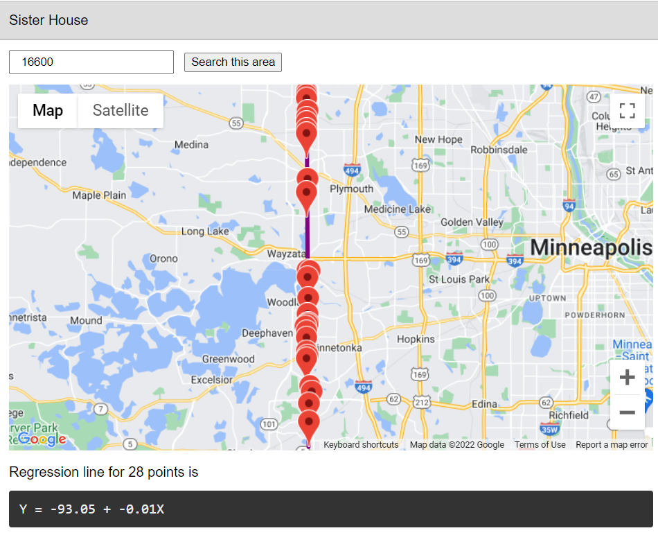

# Sister House

A "Sister House" is an address with your same house number. This tool allows you to plot all addresses with a given house number to see how well they lie on your local city planning grid.

## Inspiration

On our neighborhood walks, we know of 4 other sister houses. It was hard in my head to think of them lining up in any meaningful way without plotting them.

Now I see that in my own part of town, my house lies very near the regression line that best fits all of the homes with my same house number.

## Examples

Western Suburbs "16600"

South Minneapolis "4444"

